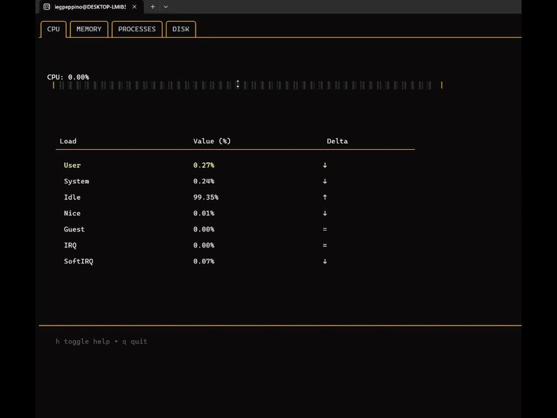

[](README.md)
[](README.md)

# syspulse

Un monitor de recursos de sistema en interfaz de usuario en terminal (TUI) programado en Go, usando [Bubbletea](https://github.com/charmbracelet/bubbletea), [Lipgloss](https://github.com/charmbracelet/lipgloss) y [Gopsutil](https://github.com/shirou/gopsutil)

Este es mi proyecto final para el bootcamp de backend de Boot.dev.
Este programa muestra barras indicadoras de carga de CPU y Memoria, como también métricas de CPU, Memoria, Procesos en Ejecución y Discos en una  interfaz de usuario en terminal TUI con una temática (basada en Fallout New Vegas) color ámbar.



## Tech Stack

- [Gopsutil](https://github.com/shirou/gopsutil?tab=readme-ov-file) - Métricas del sistema

- [Bubbletea](https://github.com/charmbracelet/bubbletea) - Motor TUI

- [Lipgloss](https://github.com/charmbracelet/lipgloss) - Estilos del TUI

- [Bubbles](https://github.com/charmbracelet/bubbles) - Componentes del TUI (tablas, mensajes de ayuda)

## Descripción

Este programa de Go, usa el ticker de _bubbletea_, para llamar periódicamente a funciones creadas usando la librería _gopsuti_l y así obtener y actualizar datos de métricas del sistema.
Esta información es desplegada en una interfaz de usuario en terminal, construida con la librería _bubbletea_ de charmbracelet, estilizada con _lipgloss_ y usando elementos tales como tables y mensajes conmutables de ayuda de _bubbles_.

El contenido se muestra en pestañas diferentes, cada una correspondiente a una categoría. Las pestañas y la información que muestran (en su respectivo orden) son:

1. __CPU__
    - Barra del total de carga del CPU (porcentual).
    - Tabla con los valores porcentuales de tiempo en los que el CPU realiza distintas operaciones.
2. __Memory__
    - Barra del total de uso de Memoria (porcentual).
    - Tabla con las cantidades de memoria Total, Usada, Libre, Disponible, en Buffer y en Cache.
3. __Procceses__
    - Tabla con los 7 procesos con mayor uso de CPU en ejecución.
    - Incluye la ID, Nombre, Estado, Tiempo de Ejecución, uso de Memoria y CPU de los procesos.
4. __Disks__
    - Tabla mostrando las particiones de disco.
    - Incluye el Punto de Montaje, Tipo de Sistema de Archivo, el espacio Total, Usado y disponible.

Las métricas son obtenidas a través de funciones del módulo __"systeminfo"__, que usa librería _gopsutil_. Estas, son periódicamente actualizadas usando un ticker de _bubbletea_ con un intérvalo de tiempo modificalbe (inicialmente configurado en 500 milisegundos).
Si algún error ocurre durante la obtención de datos, este es registrado en __/logs/errors/systemstats.log__ usando una función de registro creada con la librería _log/slog_.

_Nótese que hay una carpera y un archivo go llamados "config", que se encuentran vacíos. Su propósito es alojar un módulo a ser implementado que permite configurar umbrales de cargas del sistema para emitir registros de rendimiento y otras configuraciones adicionales._

## Configuración y Ejecución (Linux/MacOS/WSL)

1. Pre-requisitos
    - Go (Golang) 1.19 o superior instalado.
    - Git (opcional, para clonar el repositorio)

2. Clona o descarga el código
    ```bash
    git clone https://github.com/iegpeppino/syspulse.git
    cd syspulse
    ```
    O descarga [el archivo zip](https://github.com/iegpeppino/syspulse/refs/heads/main.zip) y extráelo.

3. Inicializa el módulo GO
    ```bash
    go mod init syspulse
    ```

4. Descarga Dependencias
    ```bash
    go mod tidy
    ```

5. Ejecuta el programa
    ```bash
    cd cmd
    go run .
    ```

6. Construye un ejecutable
    ```bash
    # Estando en el directorio /cmd
    go build -o syspulse
    ./syspulse
    ```

7. Opcional: Agrega a la ruta de archivo
    ```bash
    sudo mv syspulse /usr/local/bin
    # Luego, puedes solo usar:
    syspulse
    ```
## INstrucciones para Windows

1. Pre-requisitos
    - Go para Windows
    - Git para Windows (opCional)
    - Terminal de Windows o Powershell.

2. Descarga o clona el repositorio
    ```cmd
    git clone https://github.com/iegpeppino/syspulse.git
    cd syspulse
    ```
     O [descarga el archivo zip](https://github.com/iegpeppino/syspulse/refs/heads/main.zip) y extráelo.

3. Inicializa el módulo Go y Descarga Dependencias.
    ```cmd
    go mod init syspulse
    go mod tidy
    ```

4. Ejecuta el programa
    ```cmd
    cd cmd 
    go run .
    ```

5. Construye un ejecutable (opcional)
    - Estando en el directorio /cmd:
    ```cmd
    go build -o syspulse.exe
    ./syspulse.exe


_Notas para Windows:_

_Se recomienda ejecutar el archivo .exe desde el terminal, y no con doble click._

_Asegúrate de que el terminal tiene soporte para secuencia de escapes ANSI (usa el terminal de Windows o el de VSCode)._

_Puedes necesitar permisos de administrador para acceder a las métricas del hardware._

## Controles

- __(← / →) or (a / d)__ : Cambiar de Pestaña

- __(q / ctrl + c / esc)__ : Salir de la aplicación

- __( h )__ : Mostrar diálogo de ayuda completo


## Notas finales

Ya ha pasado cierto tiempo desde que me propuse aprender programación y algunas de las herramientas necesarias para adentrarme en los campos del desarrollo de software y de TI y cambiar de mi campo de trabajo actual. Mientras googleaba ideas sobre que podía tratarse mi proyecto final, me crucé con la del monitor de sistema, la cual, resonó mucho conmigo, ya que involucra estos dos campos en los que estoy tan interesado.

_Algunas otras funciones serán implementadas a futuro_
    _tales como el "pingueo" de redes, y la configuración de_
    _umbrales de carga del sistema para monitorear y producir registros_
    _cuando estos sean excedidos._
